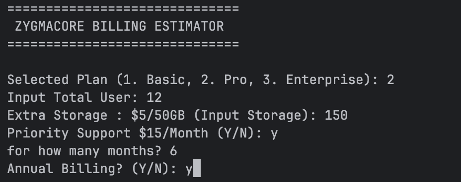
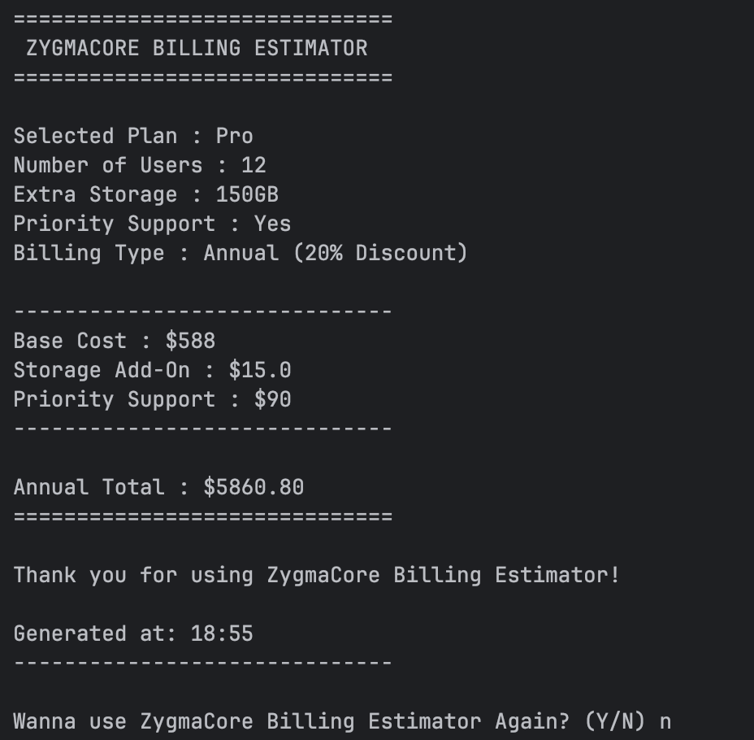

<h1 align="center">ZygmaCore Billing Estimator</h1>

<p align="center">
  
  
</p>

<p align="center">
  
</p>

<h3 align="center">
    A Python CLI tool to estimate SaaS-style billing for teams in seconds.
</h3>
---

## 📘 About The Project

**ZygmaCore Billing Estimator** is a simple yet practical **Python command-line tool** that simulates subscription billing for a SaaS product.

It allows you to:

- Choose a plan (Basic, Pro, Enterprise)
- Set the number of users
- Add extra storage
- Enable optional priority support
- Compare monthly vs annual billing with discount

Although built as a learning project, it behaves like a **real-world billing calculator**, making it perfect for both **Python practice** and **portfolio showcasing**.

### 💡 Why This Project Exists

When learning Python, many exercises focus on isolated concepts (inputs, loops, conditionals) without a “real” use case. This project connects those fundamentals into a scenario that resembles **actual product pricing logic**:

- **Developers** can quickly prototype subscription estimates.
- **Students** can practice clean input handling and validation.
- **Learners** get a project that feels like a real CLI utility instead of throwaway code.

### 🖼 Screenshot

#### Input


#### Output



---

## 🛠 Technical Stack

| Technology  | Role/Usage                          |
|------------|--------------------------------------|
| 🐍 Python  | Core programming language            |
| ⌨️ CLI     | User interaction via terminal input  |
| 🧩 `os`    | Screen clearing (`os.system("clear")`) |
| ⏱ `time`  | Displaying generation timestamp      |

---

## ✨ Key Features

- 📦 **Multiple Plans**  
  Supports **Basic**, **Pro**, and **Enterprise** plans with different base prices.

- 👥 **Per-User Billing**  
  Scales cost based on the number of users, enforcing valid numeric input.

- 💾 **Extra Storage Add-On**  
  Additional storage priced at **$5 per 50GB block**, configurable by user input.

- 🛟 **Priority Support Option**  
  Optional **priority support** priced at **$15/month**, valid for 1–12 months.

- 💰 **Annual Billing Discount**  
  Annual billing applies a **20% discount** on the combined total.

- 📊 **Detailed Cost Breakdown**  
  Shows base cost, storage add-on, priority support, and final monthly/annual total.

- 🔁 **Interactive Retry Loop**  
  After each calculation, users can choose to **run the estimator again** without restarting the program.

- 🕒 **Timestamped Output**  
  Includes a “Generated at” timestamp for a more professional feel.

---

## 🚀 Getting Started

Follow these steps to run the ZygmaCore Billing Estimator locally.

### ✅ Prerequisites

Make sure you have:

- **Python 3.8+** installed  
- A terminal (macOS, Linux, or Windows PowerShell)

> 💡 Note: The script uses `os.system("clear")`, which is common on Unix-like systems.  
> On Windows, you may want to change it to `cls` or remove the clear command.

### 📦 Installation

1. **Clone the repository**

   ```bash
   git clone https://github.com/AlhikamWarsawa/zygmacore-billing-estimator.git
   cd zygmacore-billing-estimator
   ```


2. *(Optional but recommended)* **Create and activate a virtual environment**

   ```bash
   python -m venv .venv
   # On macOS/Linux
   source .venv/bin/activate
   # On Windows
   .venv\Scripts\activate
   ```

3. **Place the script**

   Ensure the main script (for example `billing_estimator.py`) is in the project root.

### ▶️ Usage

Run the estimator from your terminal:

```bash
python billing_estimator.py
```

Example session:

```text
==============================
 ZYGMACORE BILLING ESTIMATOR
==============================

Selected Plan (1. Basic, 2. Pro, 3. Enterprise): 2
Input Total User: 10
Extra Storage : $5/50GB (Input Storage): 150
Priority Support $15/Month (Y/N): y
for how many months? 6
Annual Billing? (Y/N): y
```

Example output:

```text
==============================
 ZYGMACORE BILLING ESTIMATOR
==============================

Selected Plan : Pro
Number of Users : 10
Extra Storage : 150GB
Priority Support : Yes
Billing Type : Annual (20% Discount)

------------------------------
Base Cost : $490
Storage Add-On : $15.0
Priority Support : $90
------------------------------

Annual Total : $483.00

==============================

Thank you for using ZygmaCore Billing Estimator!

Generated at: 18:39

------------------------------

Wanna use ZygmaCore Billing Estimator Again? (Y/N)
```

---

## 🤝 Contributing

Contributions are very welcome!

If you’d like to improve the estimator, fix bugs, or extend its functionality:

1. **Fork** the repository
2. Create a new branch: `git checkout -b feature/your-feature-name`
3. Commit your changes: `git commit -m "Add your feature"`
4. Push to the branch: `git push origin feature/your-feature-name`
5. Open a **Pull Request**

Please keep changes focused and documented where necessary.

---

## 📄 License & Contact

This project is licensed under the **MIT License**.
See the `LICENSE` file for full details.

**Author Contact:**  
🌐 https://alhikam.me
🐙 https://github.com/AlhikamWarsawa